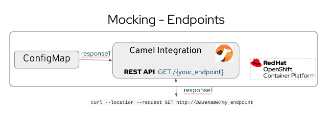

# Description

In this repository, you will find a service which represents a mock endpoint. It returns the string that you fill into the configmap mock-responses. If in the integration route doesn't find the configmap, it returns the default value: {"response": "mock response"}
The integration route exposes a REST service with a GET path and this format 127.0.0.1:8080/mock/{your path}

The development is using Quarkus and Apache Camel DSL. 

# Installation requirements

- OpenShift cluster
- JBang must be installed on your machine. See instructions on how to download and install the JBang: https://www.jbang.dev/download/ or run this command to install the latest version: 
   ```
    curl -Ls https://sh.jbang.dev | bash -s - app setup
    source ~/.bashrc
    jbang version
   ```

# How to build

1. Clone this project.
2. Open application.properties file and replace the "appdev-integration" properties values with your namespace name.
3. Create ConfigMap with the response content:
   ```
   apiVersion: v1
   kind: ConfigMap
   metadata:
     name: mock-responses
   data:
     openshift.get.message.response1: {"Example of": "mockresponse" }
   ``` 
4. Deploy:

   Sign in your OpenShift cluster:
   ```
   jbang -Dcamel.jbang.version=3.21.0 camel@apache/camel export --fresh  --directory={PROJECT_PATH}/.export && mvn clean package -f .export
   ```


# Steps followed to create this REST API (don't run these commands, this section is for documention purposes):

## Scaffold a new Camel project
Select **Karavan: Create Application** from the context menu in the VSCode editor.

    • Select Quarkus for the runtime, choose Quarkus for the runtime and enter the groupId, artifactId, and version 
    • See a new file, application.properties

## Create the Camel integration route and the REST API: 
Select **Karavan: Create Integration** from the context menu in the VSCode editor.

Open the Karavan editor (Karavan: Open) and set up:

   **REST DSL**

        - REST Configuration: to deploy in OpenShift only "platform-http" works, in case of jetty or http-netty : java.lang.IllegalArgumentException: Component netty is not a RestConsumerFactory.
        - REST: set up path, URI (direct to Camel route), bindingMode off, produces, consumes.

   **Camel Route**

        -  Set body with the Response string

## Deploy the service: 

   **Locally**

        - Karavan: Run
        
        or

        - jbang -Dcamel.jbang.version=3.21.0 camel@apache/camel run *


   **OpenShift**

   Open a terminal and sign into your OpenShift cluster
   Open and configure the application.properties setting the namespace parameter with yours value

        - Karavan: Deploy
        
        or

        - jbang -Dcamel.jbang.version=3.21.0 camel@apache/camel export --fresh  --directory={PROJECT_PATH}/.export && mvn clean package -f .export

Wait for the container image build to finish
Congratulations! You successfully created a s2i build and built container images. The image is now deployed on your Openshift


# TESTING 

Example of testing mockendpoints (the response must be filled previously in the configmap mock-responses otherwise response the default one)

curl http://localhost:8080/mock/testendpoint


curl --location --request POST 'http://mocktoken-appdev-integration.apps.ocp4.quitala.eu/token' \
--header 'Content-Type: application/json' \
--data-raw '{
"token": "test"
}'


